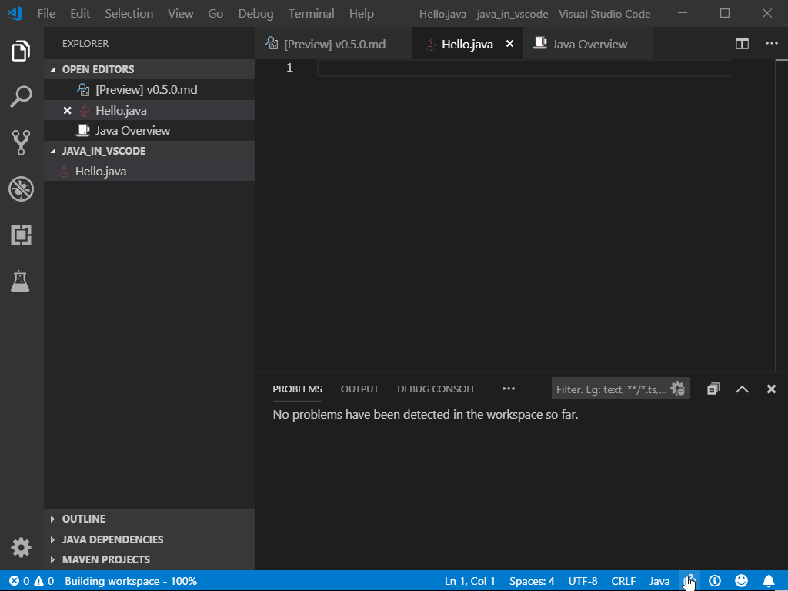
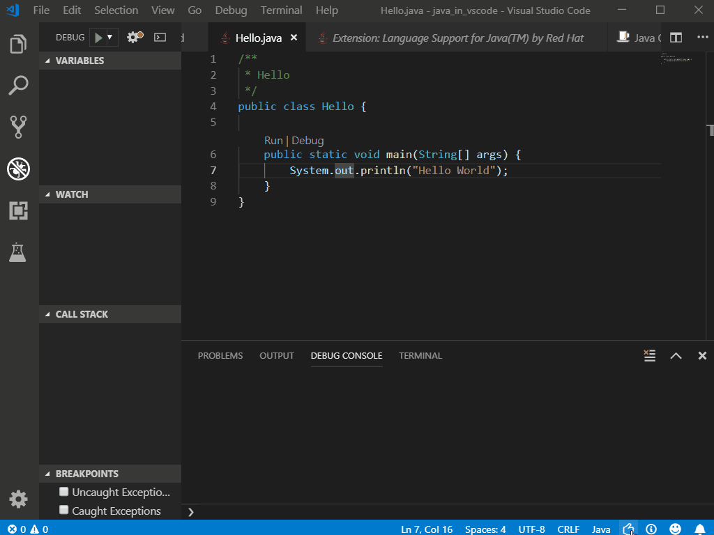

# Writing Java with Visual Studio Code

This tutorial shows you how to write and run a simple Java program with Visual Studio Code. It also covers a few advanced features, which you can explore by reading other documents in this section.

## Open Visual Studio Code. 

Java development environment including the Java Developer Kit (JDK) and Visual Studio Code are already installed and should be available on your desktop. Navigate to the Extension view by clicking on the Extension icon in the **Activity Bar** on the side of Visual Studio Code. You will then find that all the required extensions for this tutorial. 

## Create the program

Create a folder for your Java program and open the folder with Visual Studio Code. Within Visual Studio Code, you can then create a new Java file (for example, `Hello.java`). When you open that file, the Java Language Server will automatically be activated as you can see a rocket icon on the right of the Status bar. When it finishes loading, you will see a thumbs up icon instead.

## Editing code

In Visual Studio Code, you can easily use code snippets to scaffold your class and method. VS Code also provides IntelliSense for code completion.

## Running and debugging your program

Once you've written your program, it is easy to run and debug Java in Visual Studio Code. You can either click `F5` or use the **Run|Debug** CodeLens options on top of your `main()` method. Just set a breakpoint and you can see all your variables and threads in the Debug view when it's hit.

## Congratulations

Now you've finished this simple tutorial. If you'd like to learn more, please
* Join our workshop: **Visual Studio Code: Your Best Friend from Student to Professional Dev** at 11:45am on Wednesday, May 8th.
* Visit us at Visual Studio Code booth in Expo area.
* Explore more at code.visualstudio.com, download and try it out!
